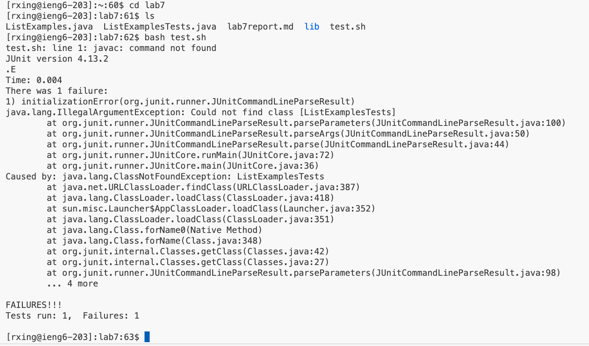
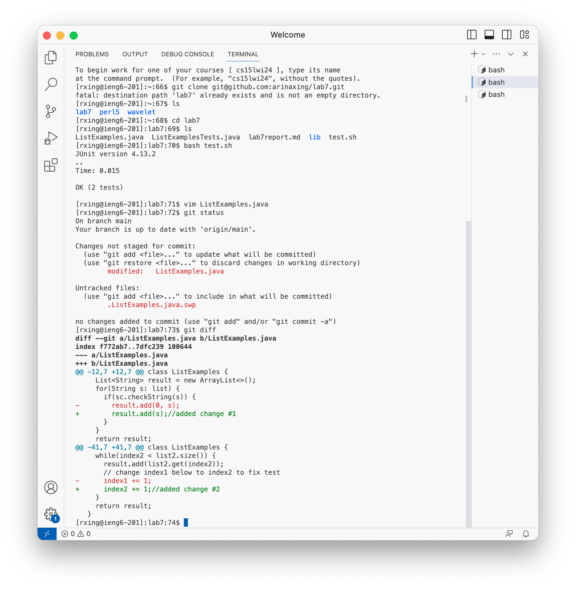
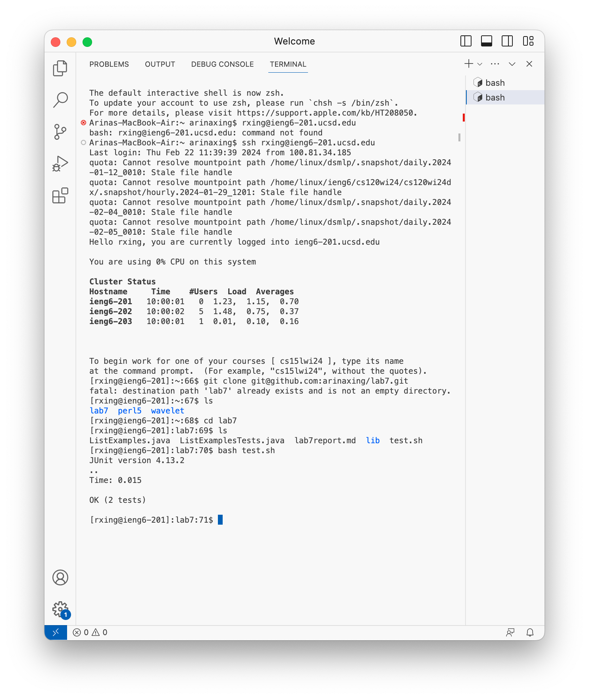

# Lab 7 
## Step 4


Inside my terminal I logged in my ieng6 account by entering on the keyboard ```ssh rxing@ieng6.ucsd.edu```.

## Step 5


I went to my github account and went to the clone button and entered lab7 repository and under ```<Code>```, I pressed ```<ssh>``` and copied the link. Back to my terminal, I entered ```<git clone>``` and ```<command v>``` to paste the ssh link I copied, then I press ```<return>```.

## Step 6


To run the tests, I first ```cd lab7``` to enter the files in this directory. I pressed ```ls``` to check what the name of my bash script is. I then entered ```bash test.sh``` to run my tests and the output shows that there was one failure. 

## Step 7



I entered ```vim ListExamples.java``` to open the file and create the edits. I used my downward arrow key to scroll to the line ```index1 += 1```. Then, using the right arrow keep I went to the first 1 and pressed ```i``` to enter insert mode. Then, I pressed ```<delete>``` and pressed ```2``` to change the ```1```. Then I pressed ```<esc>``` and pressed ```<:qw>``` to save and exit ```vim```.

## Step 8


I run the test by pressing up arrow two times to go to ```bash test.sh``` because that's when I last used it. 

## Step 9


I entered ```git add ListExamples.java```, pressed ```<return>```. Then I entered ```git commit -m "added 2 changes to ListExamples.java", pressed ```<return>```. Lastly, I pressed ```git push``` to push the changes onto github. 
